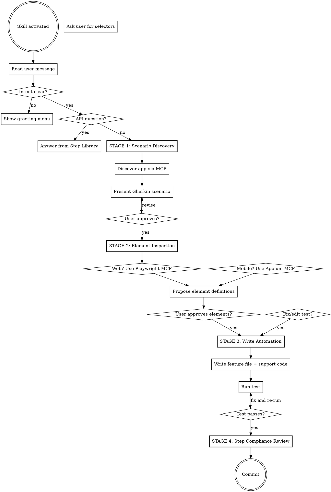

# Pickleib — Agent Skill

A Cucumber-based test automation framework that decouples **element acquisition** (via JSON repository or Java Page Objects) from **element interaction** (via built-in Cucumber steps). Tests are written in Gherkin; raw Selenium/Appium calls never appear in feature files.

## Companion Skills

| Skill | Activates when | What it does |
|---|---|---|
| `test-composer` | User asks to expand coverage or "add more scenarios" | Iterative test suite expansion across the full app |
| `bug-discovery` | After test coverage is achieved | Adversarial bug hunting after tests pass |

---

## ABSOLUTE RULES

**STOP. Read before any action.**

### 1. Do NOT skip stages
This skill operates in four stages. Complete each stage and get user approval before advancing.
Exception: API questions and fix/edit requests bypass the staged flow.

### 2. Do NOT edit `page-repository.json` or page objects without permission
Show the user the exact JSON or Java code you want to add. Wait for approval. No silent additions.

### 3. Do NOT invent selectors — inspect the live site
- **Web:** Use the Playwright MCP to navigate and inspect the real DOM.
- **Mobile/Desktop:** Use the Appium MCP if available, or ask the user for selectors.
- If no MCP is available, the user must supply all selectors. Do NOT guess.

### 4. Do NOT invent step definitions
Only use steps documented in the Step Library section below. If a step doesn't exist, tell the user.

### 5. Prefer the element repository approach matching the project
- If the project uses `page-repository.json` → add selectors to JSON.
- If the project uses Java Page Objects → add `@FindBy` fields to page classes.
- Check which approach the project uses before proposing elements.

### 6. When a test fails: read the error and logs FIRST
Run the test, read the output. Do NOT guess what went wrong. Check for:
- Missing elements → inspect the live DOM
- Wrong selectors → re-inspect
- Timing issues → add appropriate wait steps

### 7. Save application context on every page visit
During Stages 1 and 2, save what you learn about the app to `docs/app-context.md`:

```markdown
## PageName — `/route`
**Purpose:** One sentence.
**Elements:** Key interactive elements discovered.
**States:** Different states the page can be in.
**Navigation:** Reached from → Links to.
```

### Workflow
- **Run the tests** to validate your work. Do not skip this.
- **Commit** after every confirmed success. Do not batch.

---

## Staged Workflow

### Checklist

Create a task for each item and complete in order:

1. **Understand intent** — read the user's message; only show greeting if intent is unclear
2. **Stage 1: Scenario Discovery** — understand the app, clarify the scenario, produce Gherkin
3. **User approves scenario** — hard gate
4. **Stage 2: Element Inspection** — inspect the live app, propose element definitions
5. **User approves elements** — hard gate
6. **Stage 3: Write Automation** — write the feature file and any supporting code
7. **Run and validate** — execute the test, inspect failures, iterate until passing
8. **Stage 4: Step Compliance Review** — verify all steps match the Step Library
9. **Fix any issues found** — correct step usage, re-run to confirm
10. **Commit** — commit after each passing + compliant scenario

### Process Flow



---

## Opening

When the skill activates, read the user's message first. Only show the greeting menu if intent is vague:

> "How can I help you today? I can:
> - **Automate a scenario** — describe what you want to test, or give me a link to the app
> - **Scale an existing suite** — add more scenarios to existing feature files
> - **Fix or edit a test** — debug a failing scenario or modify an existing one
> - **Answer a step question** — help with Pickleib step syntax, page objects, or configuration"

### Routing

- **User described a scenario** — Go to Stage 1.
- **Step question** — Answer from the Step Library below.
- **Fix/edit** — Skip to Stage 3.
- **Scale existing** — Read existing `.feature` files, page objects, and `page-repository.json` first, then Stage 1.

---

## Stage 1: Scenario Discovery

**Goal:** Understand the application and produce Gherkin the user approves.

### Fast Path

If the user provides a complete scenario or detailed acceptance criteria:
1. Reformat into Pickleib Gherkin (using built-in step syntax).
2. Ask only about genuinely unclear parts.
3. Present for approval.

### Full Discovery

1. **Get the app URL or description.**
2. **Discover the app.** Use Playwright MCP (web) or Appium MCP (mobile) to navigate, take snapshots, and understand the app.
3. **Ask clarifying questions — one at a time:**
   - What user flow is being tested?
   - Preconditions (logged in? specific data?)
   - What constitutes success vs failure?
4. **Present the scenario** using Pickleib built-in step syntax:

```gherkin
@Web-UI @SCN-001
Scenario: Descriptive name
  * Navigate to url: https://example.com/page
  * Wait for element pageTitle on the ExamplePage to be visible
  * Fill input usernameInput on the LoginPage with text: admin
  * Click the submitButton on the LoginPage
  * Verify the text of welcomeMessage on the DashboardPage contains: Welcome
```

### Hard Gate

> "Here's the scenario I've drafted. Does this capture what you want to test? Any changes before I inspect the elements?"

---

## Stage 2: Element Inspection

**Goal:** Identify all elements needed and propose definitions matching the project's approach.

### Determine Project Approach

Check the project to determine which element definition approach is used:
- **JSON Repository:** `page-repository.json` exists → propose JSON entries
- **Java Page Objects:** `ObjectRepository.java` or `@PageObject` classes exist → propose `@FindBy` fields
- **Both:** Follow whatever the existing project uses for the relevant pages

### Web Inspection (Playwright MCP)

1. Navigate to each page in the scenario.
2. Take snapshots and inspect the DOM.
3. Prefer selectors: `data-test` / `data-testid` > `id` > stable CSS > text > XPath.

### Mobile Inspection (Appium MCP)

1. Use the Appium MCP to inspect the screen hierarchy.
2. Prefer selectors: `accessibilityId` > `id` > `className` > XPath.
3. If no Appium MCP is available, ask the user for selectors.

### Present Proposals

**For JSON Repository projects:**
```json
{
  "name": "LoginPage",
  "platform": "web",
  "elements": [
    { "elementName": "usernameInput", "selectors": { "web": [{ "id": "username" }] } },
    { "elementName": "submitButton", "selectors": { "web": [{ "css": "button[type='submit']" }] } }
  ]
}
```

**For Page Object projects:**
```java
@PageObject
public class LoginPage {
    @FindBy(id = "username")
    public WebElement usernameInput;

    @FindBy(css = "button[type='submit']")
    public WebElement submitButton;
}
```

### Hard Gate

> "These are the elements I've identified. Should I add them? Let me know if any need adjusting."

---

## Stage 3: Write Automation

**Goal:** Write the feature file and any supporting code using approved elements.

### Writing Process

1. **Check project setup.** Verify `CommonSteps.java`, `Hooks.java`, and `TestRunner.java` exist. Only create or modify if missing.
2. **Add approved elements** to `page-repository.json` or page object classes.
3. **Write the feature file** using only steps from the Step Library below.
4. **Run the test:**
   ```shell
   mvn test -Dcucumber.filter.tags="@SCN-001"
   ```
5. **If the test fails:** read the error output, diagnose, fix, and re-run. If a missing element is the cause, perform a mini-inspection (inspect DOM, propose entry, get approval).
6. **If the test passes:** proceed to Stage 4.

### Fix/Edit Mode

When fixing an existing test, skip Stages 1-2. Read the test, understand the issue, fix and run. If new elements are needed, use mini-inspection.

---

## Stage 4: Step Compliance Review

**Goal:** Verify all steps in the feature file match the Step Library exactly.

This triggers automatically every time a test passes. Review each scenario immediately.

### Review Checklist

1. **Step syntax** — every step matches a pattern from the Step Library (correct element/page naming, correct argument order).
2. **Page/element naming** — PascalCase for pages (`LoginPage`), camelCase for elements (`submitButton`), matching the definitions.
3. **Context usage** — `CONTEXT-{key}` prefix used correctly for dynamic values.
4. **Form fill format** — uses `element` / `input` column headers (not the old `Input Element` / `Input`).
5. **No invented steps** — no steps that don't exist in the Step Library.

### Output Format

> **Step Compliance Review**
>
> Reviewed: `VueTestApp.feature` — Scenario: Login flow
>
> - **Line 12** — `Fill input userName on LoginPage` should be `Fill input userName on the LoginPage` (missing "the")
>
> 1 issue found. Fixing now.

Or if clean:

> **Step Compliance Review** — All steps match the documented syntax. No issues found.

---

## Step Library

All built-in steps available when `pickleib.steps` is in the Cucumber glue path. Steps work with both JSON and Page Object approaches.

### Navigation

```gherkin
* Navigate to url: {url}
* Navigate to test url
* Go to the {pagePath} page
* Refresh the page
* Navigate browser backwards
* Navigate browser forwards
* Switch to the next tab
* Switch back to the parent tab
* Switch to the tab with handle: {handle}
* Switch to the tab number {n}
* Save current url to context
* Set window width & height as {width} & {height}
```

### Click / Tap

```gherkin
* Click the {element} on the {Page}
* Tap the {element} on the {Page}
* Click button with {text} text
* Click listed element {name} from {list} list on the {Page}
* Click listed attribute element that has {value} value for its {attribute} attribute from {list} list on the {Page}
* If present, click the {element} on the {Page}
* If enabled, click the {element} on the {Page}
* Click towards the {element} on the {Page}
* Click i-frame element {element} in {iframe} on the {Page}
```

### Input / Form

```gherkin
* Fill input {element} on the {Page} with text: {value}
* Fill input {element} on the {Page} with verified text: {value}
* Fill input {element} on the {Page} with un-verified text: {value}
* Fill form input on the {Page}
* Fill form input on the {Page} using mobile driver
* Fill form input on the {Page} using web driver
* Fill listed input {element} from {list} list on the {Page} with text: {value}
* Select option {text} from {element} on the {Page}
```

**Form fill table format:**
```gherkin
* Fill form input on the LoginPage
  | element       | input    |
  | usernameInput | admin    |
  | passwordInput | secret   |
```

Use `CONTEXT-{key}` for dynamic values:
```gherkin
* Update context testUser -> admin
* Fill input usernameInput on the LoginPage with text: CONTEXT-testUser
```

### Verify

```gherkin
* Verify the text of {element} on the {Page} to be: {text}
* Verify the text of {element} on the {Page} contains: {text}
* Verify presence of element {element} on the {Page}
* Verify absence of element {element} on the {Page}
* Verify that element {element} on the {Page} is in {state} state
* Verify that element {element} on the {Page} has {value} value for its {attribute} attribute
* Verify that {attribute} attribute of element {element} on the {Page} contains {value} value
* Verify {cssProperty} css attribute of element {element} on the {Page} is {value}
* Verify that element {element} from {list} list on the {Page} has {value} value for its {attribute} attribute
* Select listed element containing partial text {text} from the {list} on the {Page} and verify its text contains {expected}
* Perform text verification for listed elements of {list} list on the {Page} contains {text}
* Verify the url contains with the text {text}
* Assert that value of {contextKey} is equal to {value}
* Assert that value of {contextKey} is contains {value}
* Assert that value of {contextKey} is not equal to {value}
```

Element states: `enabled`, `displayed`, `selected`, `disabled`, `absent`

### Wait

```gherkin
* Wait {n} seconds
* Wait for element {element} on the {Page} to be visible
* Wait for absence of element {element} on the {Page}
* Wait until element {element} on the {Page} has {value} value for its {attribute} attribute
```

### Scroll / Swipe

```gherkin
* Scroll up using web driver
* Scroll down using web driver
* Swipe left using mobile driver
* Swipe right using mobile driver
* Scroll until listed {element} element from {list} list is found on the {Page}
* Scroll until element with exact text {text} is found using web driver
* Center the {element} on the {Page}
* Center element named {element} on the {Page} from {list}
```

### Context Store

```gherkin
* Update context {key} -> {value}
* Save context value from {sourceKey} context key to {targetKey}
* Acquire the {attribute} attribute of {element} on the {Page}
```

### Other

```gherkin
* Upload file on input {element} on the {Page} with file: {filePath}
* Execute JS command: {script}
* Execute script "{script}" on element with text "{text}"
* Add the following values to LocalStorage:
* Add the following cookies:
* Update value to {value} for cookie named {name}
* Delete cookies
* Set default platform as appium
* Set default platform as selenium
* Interact with element on the {Page} of mobile driver
* Interact with element on the {Page} of web driver
```

---

## Project Structure

A typical Pickleib project:

```
src/
  main/java/
    common/
      ObjectRepository.java          # Page Object registry (POM approach only)
    pages/
      LoginPage.java                 # @FindBy page objects (POM approach only)
  test/java/
    features/
      Login.feature                  # Gherkin scenarios
    steps/
      Hooks.java                     # @Before/@After lifecycle
    TestRunner.java                  # @CucumberOptions + @Pickleib
  test/resources/
    pickleib.properties              # Driver & timeout config
    page-repository.json             # JSON element definitions (JSON approach)
docs/
  app-context.md                     # Living app knowledge base
```

### `TestRunner.java` (JSON approach — no CommonSteps needed)
```java
@RunWith(Cucumber.class)
@Pickleib(pageRepository = "src/test/resources/page-repository.json")
@ExtendWith(PickleibRunner.class)
@CucumberOptions(
    features = "src/test/resources/features",
    glue = {"steps", "pickleib.steps"}
)
public class TestRunner {}
```

### `TestRunner.java` (Page Object approach)
```java
@RunWith(Cucumber.class)
@Pickleib(scanPackages = {"pages"})
@ExtendWith(PickleibRunner.class)
@CucumberOptions(
    features = "src/test/resources/features",
    glue = {"steps", "pickleib.steps"}
)
public class TestRunner {}
```

### `Hooks.java`
```java
import io.cucumber.java.*;
import pickleib.web.driver.PickleibWebDriver;

public class Hooks {
    @Before
    public void setup(Scenario scenario) {
        PickleibWebDriver.initialize();
    }

    @After
    public void teardown() {
        PickleibWebDriver.terminate();
    }
}
```

### `pickleib.properties`
```properties
browser=chrome
headless=false
driver-timeout=15000
element-timeout=15000
test-url=http://localhost:8080
```
